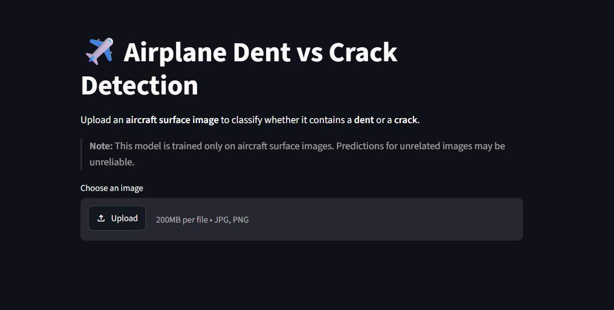
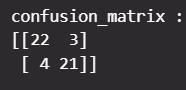
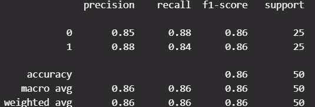

# ✈️ Airplane Dent vs Crack Detection using Deep Learning

An AI-powered image classification system that detects whether an aircraft surface contains a **Dent** or a **Crack** using a fine-tuned **VGG16 Convolutional Neural Network**. The project is deployed as a **Streamlit web application** with the trained model hosted on **Hugging Face Hub**.

---

## 🚀 Live Demo

**Streamlit App:**  
https://airplane-dent-vs-crack.streamlit.app/

**Model (Hugging Face):**  
https://huggingface.co/Smit-Pandit/DentCrackModel

---

## 📌 Overview

Aircraft surface damage detection is an important aspect of aviation maintenance and safety. Manual inspection can be time-consuming and subjective.

This project uses Transfer Learning with VGG16 to automatically classify aircraft surface images into:

- 🟢 Dent
- 🔴 Crack

The application allows users to upload an aircraft image and instantly receive the predicted damage type along with the model's confidence score.

---

# Features

- ✅ Transfer Learning using VGG16
- ✅ Binary image classification
- ✅ Image upload through Streamlit
- ✅ Confidence score visualization
- ✅ Hugging Face model hosting
- ✅ Fast inference
- ✅ Responsive web interface

---
# Screenshot



---

# Model Architecture

- Base Model: **VGG16 (ImageNet Weights)**
- Framework: TensorFlow / Keras
- Transfer Learning
- Binary Classification
- Sigmoid Output Layer

Input Image Size:

```
224 × 224 × 3
```

---

# Tech Stack

| Category | Technology |
|-----------|------------|
| Language | Python |
| Deep Learning | TensorFlow, Keras |
| Model | VGG16 |
| Frontend | Streamlit |
| Image Processing | Pillow, NumPy |
| Model Hosting | Hugging Face Hub |
| Version Control | Git & GitHub |

---

# Project Structure

```
Airplane-Dent-VS-Crack/
│
├── app.py
├── requirements.txt
├── runtime.txt
├── README.md
└── assets/
```

---

# Installation

Clone the repository

```bash
git clone https://github.com/Smit-Pandit/Airplane-Dent-VS-Crack.git
```

Move into the project directory

```bash
cd Airplane-Dent-VS-Crack
```

Install dependencies

```bash
pip install -r requirements.txt
```

Run Streamlit

```bash
streamlit run app.py
```

---

# How it Works

1. Upload an aircraft surface image.
2. Image is resized to **224 × 224**.
3. VGG16 preprocessing is applied.
4. The trained model predicts the probability.
5. The application displays:
   - Predicted class
   - Confidence score
   - Probability bars

---

# Results

| Metric | Value |
|---------|------:|
| Model | VGG16 Transfer Learning |
| Classification | Binary |
| Test Accuracy | **84%** |

## 📊 Confusion Matrix


## 📈 Classification Report


---

# Example Predictions

| Image | Prediction |
|---------|------------|
| Aircraft Dent | Dent |
| Aircraft Crack | Crack |

---

# Limitations

- Trained only on aircraft surface images.
- Supports only two classes:
  - Dent
  - Crack
- Predictions on unrelated images (animals, cars, buildings, etc.) may be unreliable.
- Intended for educational and research purposes only.

---

# Future Improvements

- Grad-CAM visualization
- Multi-class damage detection
- Detection of normal aircraft surfaces
- Damage localization using Object Detection
- Mobile application deployment
- Larger and more diverse dataset

---

# Author

**Smit Pandit**

GitHub:
https://github.com/Smit-Pandit

Hugging Face:
https://huggingface.co/Smit-Pandit

---

# License

This project is licensed under the Apache-2.0 License.

---

## ⭐ If you found this project useful, consider giving it a star!
